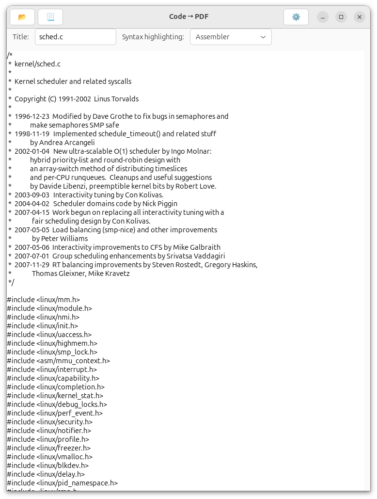
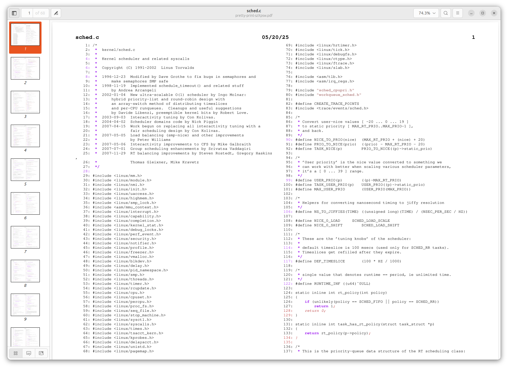
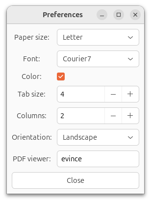

# Code2PDF
Code2PDF is a frontend for `enscript` and `ps2pdf`. You can copy and paste your source code into its main window, for example from a text editor, online example, or AI, and a couple clicks later, have a syntax-highlighted, line-numbered PDF ready for printing to support your coding wizardry. You can also open source files on your computer.





## Installing
```
~/src/coulter-rs/code2pdf$ cargo install --path .
```

### Install GSettings Schema
#### Compiling and Installing the GSettings Schema
This schema is required for Code2PDF to persist configuration settings in the GSettings database like a well-behaved GNOME application.
```
~/src/coulter-rs/code2pdf$ mkdir -p ~/.local/share/glib-2.0/schemas/
~/src/coulter-rs/code2pdf$ cp schemas/com.github.username.sebastiandanconia.code2pdf.gschema.xml ~/.local/share/glib-2.0/schemas
~/src/coulter-rs/code2pdf$ glib-compile-schemas ~/.local/share/glib-2.0/schemas/
```

As an alternative, temporary development setup, you can use:
```
~/src/coulter-rs/code2pdf$ export GSETTINGS_SCHEMA_DIR=./schemas
~/src/coulter-rs/code2pdf$ glib-compile-schemas ./schemas/
```

You can check that the schema is correctly installed using:
```
~/src/coulter-rs/code2pdf$ gsettings list-schemas | grep com.github.username.sebastiandanconia
```
Expected output:
```
com.github.username.sebastiandanconia.code2pdf
```

## Debugging Hints
```
$ gsettings get com.github.username.sebastiandanconia.code2pdf syntax
'javascript'
```

## Known Limitations
- Enscript doesn't currently include syntax highlighting for Rust.
- When changing the PDF viewer application, you enter the program name as text, rather than navigating to it in a `FileDialog`.
- Full GNOME integration isn't currently implemented: Although it's a GUI program, you have to start it from the command line, and it has no custom icon.
